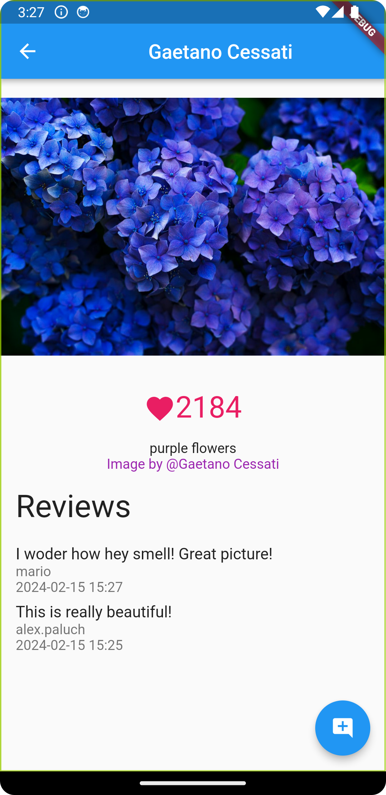

# unsplash_gallery

This repository contains the final project assigned during the Flutter Google Digital Programming Workshop offered by 
Digital Stack Course 

# Screenshots

## Home page

## Photo page

# Features

- **Unsplash API Integration:** Access a vast collection of high-quality images from the Unsplash API.
- **Search Functionality:** Users can search for specific images based on keywords.
- **Color Filtering:** Filter images by color to find the perfect match for your needs.
- **Firebase Database Integration:** Utilizes Firebase as a backend database to store user data and preferences.
- **User Authentication:** Users can sign in to the app, and their profile pictures are stored in Firebase.
- **Image Details Page:** Each photo has its own page displaying details such as likes, description, and author information.
- **User Reviews:** Logged-in users can leave reviews for images, which are saved to the database and can be viewed by other users.

# Installation

1. Clone the repository to your local machine.
2. Ensure you have Flutter installed. If not, follow the [official installation guide](https://flutter.dev/docs/get-started/install).
3. Set up Firebase for your project and replace the Firebase configuration details in the code.
4. Run `flutter pub get` to install dependencies.
5. Set up the unsplash API by creating an account and adding a key to your project inside of the .env file wich 
   should be made in the root.
6. Connect your device or emulator and run `flutter run` to launch the app.

## Contributing

Contributions are welcome! If you have any suggestions, enhancements, or bug fixes, please submit a pull request.
